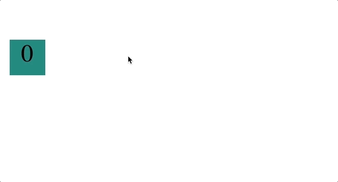

# Py Bouncing Box

### Learn Python-Based Web Development: Create an Interactive Bouncing Box Game

**Table of Contents**

- [Overview](#overview)
  - [Takeaways](#takeaways)
  - [More About Brython](#a-note-on-brython)
- [Lesson Steps](#lesson-steps)
  - [Work Flow](#work-flow-how-to-navigate-through-the-lesson-steps)
  - [TODO 0: Preview Your Site with Live Server](#todo-0-preview-your-site-with-live-server)
  - [TODO 1: Understand the Brython Boilerplate](#todo-1-understand-the-brython-boilerplate)
  - [TODO 2: Set Up Variables to Move the Box](#todo-2-set-up-positionx-to-move-the-box)
  - [TODO 3: Reset Box When Clicked](#todo-3-reset-positionx-and-display-initial-text-on-box-click)
  - [TODO 4: Keeping Score](#todo-4-set-up-and-update-the-score)
  - [TODO 5: Speeding Up](#todo-5-speeding-up)
  - [TODO 6: Make the Box Bounce (part 1)](#todo-6-make-the-box-bounce-off-the-right-side)
  - [TODO 7: Make the Box Bounce (part 2)](#todo-7-make-the-box-bounce-off-the-left-side)
  - [TODO 8: Fix a bug!](#todo-8-fix-the-speed-bug-with-a-linear-formula)
  - [TODO 9: Go Live](#todo-9-go-live)

# Overview

In this project, you'll create a simple game where a box moves across the screen, increasing in speed with each click, using Python in the browser with Brython.



Our goal is to see how HTML, CSS, and Python come together to create interactive web content:

- **HTML** defines the structure of the page
- **CSS** styles the elements on the page
- **Python with Brython** makes the game interactive, responding to events and modifying the box's position

<br>
<br>
<br>

### **Takeaways**

This project will introduce you to several core programming concepts:

- Basic principles of animation
- Event handling in Python with Brython
- Using variables to store data
- Using `if` statements to make conditional changes in the game
- Web development with Python instead of JavaScript

<br>
<br>
<br>

### **A Note on Brython**

<details>
<summary>Expand to learn about Brython</summary>

[Brython](https://brython.info/) is a Python implementation that runs in the browser. It allows you to write Python code that gets executed as JavaScript, making it possible to use Python for web development instead of JavaScript.

With Brython, you can:
- Access and manipulate HTML elements
- Handle browser events
- Create dynamic web applications
- Use many of Python's standard libraries

While traditional web development uses JavaScript for client-side programming, Brython offers a Python-focused alternative that may feel more familiar to Python developers.

```python
from browser import document

# Example of Brython code
def say_hello(event):
    document["output"].textContent = "Hello, World from Python!"

document["my-button"].bind("click", say_hello)
```

This code binds a click event to a button that updates text content when clicked—all written in Python syntax rather than JavaScript!
</details>

<!-- 4 line breaks between TODOs -->
<br><br><br><br>

# Lesson Steps

## **Work Flow: How to Navigate Through the Lesson Steps**

🎯 **Goal:** Learn how to follow the steps in this lesson to build and customize your game one step at a time.

---

### Step-by-Step Work Flow

1. 📂 **Open your Bouncing Box project's `index.html` file** in your codespace to get started.
   - 🔍 Locate the file tree (the list of files and folders) in the left panel of your codespace.
   - Click the `py-projects` folder 📂 in your file tree to expand the list of projects.
   - Click on the `brython-bouncing-box` folder 📂 located within the `py-projects` folder.
   - Click on the `index.html` file located within the `brython-bouncing-box` folder 📂. ***Coding for all steps will be done in this file.***

2. **Follow the instructions carefully** for each TODO:
   - Pay attention to where new code should be added.
   - Only code inside the designated areas
      - Make sure all code is added below the `YOUR CODE BELOW HERE` comment.

3. 🖥️ **Preview your game regularly using Live Server** to see how your changes affect the game level.

4. **Important Note**: *None of the code provided in these instructions should be copied and pasted into your project*.
   - All code snippets are examples meant to guide you in writing your own code and provide a general description of what changes happen throughout the program.

---

<table>
  <tr>
    <th>
      💡 Key Reminders
    </th>
  </tr>
  <tr>
    <td>
      - 📖 Read each step closely before adding any code.<br>
      - 🖥️ Preview frequently to make sure your game is structured the way you would like it.
    </td>
  </tr>
</table>

---

<br>

### ✅ **Check Your Work!**

- **After each TODO**, double-check your code to ensure it matches the examples.
- If you encounter issues, **preview your site** using Live Server to troubleshoot.

<!-- 4 line breaks between TODOs -->
<br><br><br><br>

## **TODO 0: Preview Your Site with Live Server**

🎯 **Goal:** Preview your bouncing box game in the browser to see how it looks and behaves as you make changes.

---

### Step-by-Step Instructions

There are two ways to open your project with **Live Server**:

#### **Option 1: Right-Click Method**

1. 📂 **Find the `index.html` file** in the file tree on the left side of your codespace.
2. **Right-click on `index.html`** and select **"Open with Live Server."**

#### **Option 2: Go Live Button in the Bottom Panel**

1. **Look at the bottom-right corner** of your codespace.
2. **Click the "Go Live" button** to launch Live Server.

<br>

### ✅ **Check Your Work!**

- **After launching Live Server**, your browser should open a new tab with your site.
- By default, Live Server will always load your home page. To view your bouncing box game:
  - Click the link to your Portfolio page to access your project links.
  - Then navigate to your Bouncing Box project by clicking the Bouncing Box link.

<!-- 4 line breaks between TODOs -->
<br><br><br><br>

## **TODO 1: Understand the Brython Boilerplate**

🎯 **Goal:** Understand the basic structure of the Brython code and how it connects to the HTML elements.

---

### Step-by-Step Instructions

1. **Examine the HTML Structure**

   - 🔍 **Locate the `<div id="box">?</div>` element** in the HTML. This is the box that we'll be animating.
   - Note that the page includes two script tags:
     - One for loading the Brython library
     - Another with `type="text/python"` containing our Python code

2. **Review the Brython Python Script**

   - 🔍 **Locate the `<script type="text/python">` tag**. This is where we'll be writing our Python code.
   - Review the basic structure:
     ```python
     from browser import document, window
     
     # Get the box and board elements
     box = document["box"]
     board = document["board"]
     
     # Function to update box position
     def update_position():
         # Your code will go here
         
     # Function to handle box click
     def on_box_click(event):
         # Your code will go here
         
     # Set up event listeners
     box.bind("click", on_box_click)
     
     # Start the animation loop
     def start_animation():
         update_position()
         window.setTimeout(start_animation, 50)
         
     start_animation()
     ```

3. **Understand the Helper Functions**

   - Note the following helper functions that have been provided:
     ```python
     # Function to move the box to a specific x position
     def move_box_to(x_position):
         box.style.left = f"{x_position}px"
         
     # Function to change the text in the box
     def change_box_text(text):
         box.textContent = str(text)
     ```

---

<table>
  <tr>
    <th>
      💡 Review Important Concepts
    </th>
  </tr>
  <tr>
    <td>
      <strong>Brython Imports</strong>: The <code>from browser import document, window</code> import allows Python to interact with the browser DOM and window object.<br><br>
      <strong>DOM Access</strong>: <code>document["box"]</code> gets a reference to the HTML element with id="box" (similar to <code>document.getElementById("box")</code> in JavaScript).<br><br>
      <strong>Animation Loop</strong>: <code>window.setTimeout(start_animation, 50)</code> creates a loop that runs the animation every 50 milliseconds.
    </td>
  </tr>
</table>

---

<br>

### ✅ **Check Your Work!**

- **Preview your game** in Live Server to see the basic structure.
- The box should be visible but not moving yet, as we haven't added the animation code.
- Make sure you understand the general structure before moving on.

<!-- 4 line breaks between TODOs -->
<br><br><br><br>

## **TODO 2: Set Up `positionX` to Move the Box**

🎯 **Goal:** Create a variable to track the box's x-position, then use it to move the box within the game.

---

### Step-by-Step Instructions

1. **Define the `positionX` Variable**

   - 🔍 Locate the area at the top of the Python script after the box and board variables are defined.
   - Add the comment `# Variable declarations below here` and create a variable called `positionX` with a value of `0`:
     ```python
     # Variable declarations below here
     positionX = 0
     ```

2. **Update `positionX` in the `update_position` Function**

   - Locate the `update_position` function.
   - Inside the function, add `10` to `positionX` to move the box to the right:
     ```python
     def update_position():
         global positionX  # Need this to modify the global variable
         positionX = positionX + 10
     ```
   - **Note**: In Python, to modify a global variable inside a function, you need to use the `global` keyword.

3. **Call `move_box_to` Function**
   - Add a line to call the `move_box_to` function with `positionX` as the argument:
     ```python
     def update_position():
         global positionX
         positionX = positionX + 10
         move_box_to(positionX)
     ```

---

<table>
  <tr>
    <th>
      💡 Review Important Concepts
    </th>
  </tr>
  <tr>
    <td>
      <strong>🔄 update_position</strong>: This function runs every 50 milliseconds, creating a continuous loop for your game.<br><br>
      <strong>Global Variables</strong>: In Python, you need to declare <code>global positionX</code> to modify the variable inside a function.<br><br>
      <strong>⬆️ Incrementing Variables</strong>: To increase a variable's value by a specific amount, use this pattern:<br>
      <code>variableName = variableName + amount</code>
    </td>
  </tr>
</table>

---

<br>

### ✅ **Check Your Work!**

- **Preview the game** in Live Server to confirm the box is moving to the right constantly.
  - The box will keep moving to the right and go past the edge of the screen since `positionX` is constantly increasing. You'll add a fix for this in a later step.
- Make sure your code calls `move_box_to(positionX)` in the `update_position` function so the box's position is updated continuously.

<!-- 4 line breaks between TODOs -->
<br><br><br><br>

## **TODO 3: Reset `positionX` and Display Initial Text on Box Click**

🎯 **Goal:** Make the box return to the starting position and update the text on the box whenever it's clicked.

---

### Step-by-Step Instructions

1. 🔍 **Locate the `on_box_click` Function**

   - This function is called whenever the box is clicked.

2. **Reset `positionX` to `0` in `on_box_click`**

   - Inside the `on_box_click` function, add the `global positionX` declaration to access the global variable.
   - Re-assign `positionX` to `0` to reset the box's x-position:
     ```python
     def on_box_click(event):
         global positionX
         positionX = 0
     ```

3. **Display Text on the Box**

   - Below the line where you reset `positionX`, add a call to the `change_box_text()` function with an argument of `0`. This will display `0` on the box to represent the starting score.
     ```python
     def on_box_click(event):
         global positionX
         positionX = 0
         change_box_text(0)
     ```

---

<table>
  <tr>
    <th>
      💡 Review Important Concepts
    </th>
  </tr>
  <tr>
    <td>
      <strong>📥 on_box_click</strong>: This function executes whenever the box is clicked, due to the event binding <code>box.bind("click", on_box_click)</code>.<br><br>
      <strong>change_box_text</strong>: This function displays a number or text on the box. By calling it with <code>change_box_text(0)</code>, the box will display <code>0</code> when clicked.
    </td>
  </tr>
</table>

---

<br>

### ✅ **Check Your Work!**

- **Preview your game** in Live Server, click the box, and confirm that it:
  - Resets to the left side of the screen, and
  - Displays the number `0`.
- Make sure the `on_box_click` function contains code to reset `positionX` and call `change_box_text(0)`.

<!-- 4 line breaks between TODOs -->
<br><br><br><br>

## **TODO 4: Set Up and Update the Score**

🎯 **Goal:** Create a score-tracking variable that increases each time the box is clicked and displays the current score on the box.

---

### Step-by-Step Instructions

1. **Create the `points` Variable**

   - 🔍 Locate the section where you initially declared the `positionX` variable.
   - Below `positionX`, create a variable called `points` and set it to `0`. This variable will store the number of times the box has been clicked.
     ```python
     # Variable declarations below here
     positionX = 0
     points = 0
     ```

2. **Update `change_box_text` to Use `points`**

   - 🔍 Locate the `on_box_click` function where you call `change_box_text(0)`.
   - Update the call by replacing the value `0` with the `points` variable:
     ```python
     change_box_text(points)
     ```

3. **Increment the `points` Variable on Each Click**
   - Add the `global points` declaration at the top of the `on_box_click` function.
   - Above the `change_box_text(points)` call, add a line of code to increase `points` by `1`:
     ```python
     def on_box_click(event):
         global positionX, points
         positionX = 0
         points = points + 1  # Increase points by 1
         change_box_text(points)
     ```

---

<table>
  <tr>
    <th>
      💡 Review Important Concepts
    </th>
  </tr>
  <tr>
    <td>
      <strong>change_box_text</strong>: This function changes the text displayed on the box based on the value passed to it.<br><br>
      <strong>Multiple Global Variables</strong>: You can declare multiple global variables by separating them with commas: <code>global positionX, points</code>.<br><br>
      <strong>📈 Incrementing Variables</strong>: Incrementing a variable (like <code>points</code>) allows it to increase each time the code runs.
    </td>
  </tr>
</table>

---

<br>

### ✅ **Check Your Work!**

- **Preview your game** in Live Server, click the box, and confirm that:
  - The displayed score on the box increases by `1` with each click.
  - The score persists on the box even after multiple clicks.
- **Note**: When you first run the game, the box will show "?" until you click it for the first time.

<!-- 4 line breaks between TODOs -->
<br><br><br><br>

## **TODO 5: Speeding Up**

🎯 **Goal:** Increase the speed of the box each time it is clicked to make the game more challenging.

---

### Step-by-Step Instructions

1. **Create a `speed` Variable**

   - 🔍 Locate the section where the `positionX` and `points` variables are declared.
   - Below `points`, create a new variable named `speed` and set it to `10`. This variable will control how fast the box moves across the screen.
     ```python
     # Variable declarations below here
     positionX = 0
     points = 0
     speed = 10
     ```

2. **Use `speed` to Replace the Hard-Coded Value in `update_position`**

   - 🔍 Locate the `update_position` function where `positionX` is increased by `10`.
   - Replace the hardcoded value `10` with the `speed` variable:
     ```python
     def update_position():
         global positionX
         positionX = positionX + speed  # Use speed variable instead of 10
         move_box_to(positionX)
     ```

3. **Increase `speed` Each Time the Box is Clicked**
   - Add `speed` to the list of global variables in the `on_box_click` function.
   - Add a line of code that increases `speed` by `3` each time the box is clicked:
     ```python
     def on_box_click(event):
         global positionX, points, speed
         positionX = 0
         points = points + 1
         speed = speed + 3  # Increase speed by 3
         change_box_text(points)
     ```

---

<table>
  <tr>
    <th>
      💡 Review Important Concepts
    </th>
  </tr>
  <tr>
    <td>
      <strong>Dynamic Variables</strong>: By using a variable like <code>speed</code> instead of a hard-coded number, we can adjust the box's speed throughout the game.<br><br>
      <strong>Global Variable List</strong>: Remember to update your <code>global</code> statement whenever you need to modify additional global variables inside a function.
    </td>
  </tr>
</table>

---

<br>

### ✅ **Check Your Work!**

- **Preview the game** in Live Server, click the box, and confirm that the box's speed increases with each click.

<!-- 4 line breaks between TODOs -->
<br><br><br><br>

## **TODO 6: Make the Box Bounce off the Right Side**

🎯 **Goal:** Prevent the box from moving off the screen by making it bounce back in the opposite direction when it reaches the right edge.

---

### Step-by-Step Instructions

1. **🔍 Locate the `update_position` Function**

2. **Set Up an `if` Statement for the Right Boundary**

   - We want to stop the box from moving off the right side of the screen. Add an `if` statement that will run when `positionX` moves the box too far to the right.
   - Add an `if` statement to check if `positionX` is greater than `board.clientWidth`:
     ```python
     def update_position():
         global positionX, speed
         positionX = positionX + speed
         
         # Check right boundary
         if positionX > board.clientWidth:
             # Code to reverse speed goes here
         
         move_box_to(positionX)
     ```

3. **Reverse `speed` to Make the Box Change Directions**
   - Inside the `if` statement's code block, make the box move in the opposite direction by changing `speed` to its opposite value. Multiply `speed` by `-1` to reverse it:
     ```python
     if positionX > board.clientWidth:
         speed = speed * -1  # Reverse direction
     ```

---

<table>
  <tr>
    <th>
      💡 Review Important Concepts
    </th>
  </tr>
  <tr>
    <td>
      <strong>Boundary Detection</strong>: By using <code>board.clientWidth</code> as a reference for the right side of the screen, we can check when <code>positionX</code> has moved too far.<br><br>
      <strong>Direction Reversal</strong>: Multiplying <code>speed</code> by <code>-1</code> flips its direction, making the box move in the opposite direction along the x-axis.
    </td>
  </tr>
</table>

---

<br>

### ✅ **Check Your Work!**

- **Preview your game** in Live Server, and observe what happens when the box reaches the right side of the screen.
  - Does the box change direction and move left when it reaches the right edge?
- Confirm that your `if` statement correctly detects the boundary and reverses `speed`.

<!-- 4 line breaks between TODOs -->
<br><br><br><br>

## **TODO 7: Make the Box Bounce off the Left Side**

🎯 **Goal:** Prevent the box from moving off the screen by making it bounce back when it reaches the left edge.

---

### Step-by-Step Instructions

1. **🔍 Locate the `update_position` Function**

2. **Set Up an `if` Statement for the Left Boundary**
   - **Below the first `if` statement's code block**, add a second `if` or an `elif` statement to detect when `positionX` has moved too far to the left.
   - Add an `if` or `elif` statement to check if `positionX` is less than `0`:
     ```python
     def update_position():
         global positionX, speed
         positionX = positionX + speed
         
         # Check right boundary
         if positionX > board.clientWidth:
             speed = speed * -1
         
         # Check left boundary
         if positionX < 0:
             # Code to reverse speed goes here
         
         move_box_to(positionX)
     ```

3. **Reverse `speed` to Make the Box Turn Around**
   - Inside the new `if` statement's code block, reverse the box's direction by changing `speed` to its opposite value:
     ```python
     if positionX < 0:
         speed = speed * -1  # Reverse direction
     ```

---

<table>
  <tr>
    <th>
      💡 Review Important Concepts
    </th>
  </tr>
  <tr>
    <td>
      <strong>Boundary Detection</strong>: Setting <code>positionX &lt; 0</code> checks if the box has moved too far left, reaching the boundary.<br><br>
      <strong>Multiple Conditions</strong>: By using separate <code>if</code> statements, we check both the left and right boundaries independently.
    </td>
  </tr>
</table>

---

<br>

### ✅ **Check Your Work!**

- **Preview your game** in Live Server, and observe what happens when the box reaches the left side of the screen.
  - Does the box change direction and move right when it reaches the left edge?
- Confirm that your `if` statement correctly detects the boundary and reverses `speed`.

<br><br>

### 🐛 **Find a Bug**

- There is currently a small bug 🐛 in your game.
- Click on the box 2-3 times when it is moving to the right. You should notice it get faster.
- Next, click on the box when it is moving to the left, **after** it has already bounced off the right wall.
   - *What do you notice after clicking the box 2-3 times when it is moving left?*
   - *Why does it make sense mathematically that the box slows down in this manner?*
- This bug 🐛, where the box slows down when clicked, will be fixed in the next (and final) TODO.

<!-- 4 line breaks between TODOs -->
<br><br><br><br>

## **TODO 8: Fix the Speed Bug with a Linear Formula**

🎯 **Goal:** Use a formula to make `speed` increase in a consistent, predictable way based on the number of clicks.

In this TODO, we'll fix the `speed` bug 🐛 by calculating `speed` using a linear formula. This approach is based on the equation `y = mx + b`.

<table>
  <tr>
    <th>
      📐 Understanding Algebraic Connections
    </th>
  </tr>
  <tr>
    <td>
      The formula <code>speed = 3 * points + 10</code> is based on the linear equation <code>y = mx + b</code><br><br>
      <strong>y</strong>: the value we want to calculate. In this case, <code>speed</code><br>
      <strong>m</strong>: the slope, or the rate at which <code>speed</code> should increase with each click. In this case, <code>3</code><br>
      <strong>x</strong>: the number of points, which is determine by the number of box clicks<br>
      <strong>b</strong>: the initial value of <code>speed</code>, or <code>10</code><br><br>
      By calculating <code>speed</code> based on this relationship, we can keep it consistent and predictable as <code>points</code> increase.
    </td>
  </tr>
</table>

---

### Step-by-Step Instructions

1. **🔍 Locate the `on_box_click` Function**

2. **Remove the line of code** where speed is being increased by 3.
   - This line will be replaced by new code added in this TODO.

3. **Understand How `speed` Changes with `points`**

   - Here's a table showing the values of `points` and `speed` using the formula:

   | Points (x) | Speed Calculation | Speed (y) |
   | ---------- | ----------------- | --------- |
   | 0          | `(3 * 0) + 10`    | 10        |
   | 1          | `(3 * 1) + 10`    | 13        |
   | 2          | `(3 * 2) + 10`    | 16        |
   | 3          | `(3 * 3) + 10`    | 19        |
   | 4          | `(3 * 4) + 10`    | 22        |

4. **Apply the Linear Formula**
   - Add a line of code that recalculates `speed` based on the current value of `points`:
     ```python
     def on_box_click(event):
         global positionX, points, speed
         positionX = 0
         points = points + 1
         
         # Calculate speed using the formula: speed = 3 * points + 10
         speed = 3 * points + 10
         
         # Preserve the direction of movement
         if speed < 0:
             speed = speed * -1
         
         change_box_text(points)
     ```

5. **Fix for Direction**
   - To maintain the current direction, we need to check the sign of `speed` before applying the formula:
     ```python
     def on_box_click(event):
         global positionX, points, speed
         
         # Store the direction before changing speed
         direction = 1 if speed > 0 else -1
         
         positionX = 0
         points = points + 1
         
         # Calculate the magnitude of speed using the formula
         speed_magnitude = 3 * points + 10
         
         # Apply the correct direction
         speed = speed_magnitude * direction
         
         change_box_text(points)
     ```

---

<table>
  <tr>
    <th>
      💡 Review Important Concepts
    </th>
  </tr>
  <tr>
    <td>
      <strong>Linear Equation</strong>: The equation <code>y = mx + b</code> allows us to calculate values in a linear relationship.<br><br>
      <strong>Direction Preservation</strong>: We need to maintain the current direction of movement (positive or negative) when recalculating speed.<br><br>
      <strong>Conditional Expression</strong>: <code>1 if speed > 0 else -1</code> is a Python conditional expression that returns 1 if speed is positive, -1 otherwise.
    </td>
  </tr>
</table>

---

<br>

### ✅ **Check Your Work!**

- **Preview your game** in Live Server, click the box, and observe how `speed` changes with each click.
  - Does `speed` increase by `3` with every click?
  - Click the box when it is moving from right to left. Ensure that the box does not slow down when this happens.

<!-- 4 line breaks between TODOs -->
<br><br><br><br>

## Explore Bonus Challenges

We've compiled a list of optional **bonus challenges** for you to take this project to the next level.

- Add color changes to the box based on speed
- Make the box move vertically as well as horizontally
- Add multiple boxes to the screen
- Create obstacles that the box must avoid
- Add sound effects when the box bounces or is clicked

<!-- 4 line breaks between TODOs -->
<br><br><br><br>

## **TODO 9: Go Live**

🎯 **Goal:** Push your changes to GitHub and make your bouncing box game go live.

---

### Step-by-Step Instructions

1. **Open the terminal in your codespace**

   - If the terminal isn't visible, click the **Hamburger Menu > Terminal > New Terminal**.

2. **Enter the following commands one by one** in the terminal, pressing enter after each command to run it:

   ```bash
   git add .
   git commit -m "completed brython bouncing box project"
   git push
   ```

3. **Wait a few minutes for the changes to go live at your-username.github.io.**

---

<br>

### ✅ **Check Your Work!**

- Visit the site `your-github-username.github.io` to see your website live on the internet. If it doesn't appear immediately, wait a few minutes and try refreshing your page.
- Navigate to your Bouncing Box link on your Portfolio page to ensure it is live on the web.

<br>
<hr>
<br>

### 🎉🎉🎉 Congratulations! You've created a Bouncing Box game using